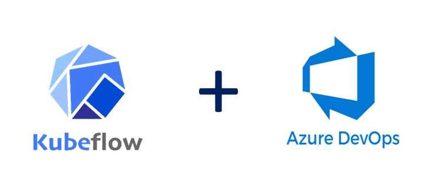

| Pipeline     | Status                                                                                                                                                                                                                                                                  |
| ------------ | ----------------------------------------------------------------------------------------------------------------------------------------------------------------------------------------------------------------------------------------------------------------------- |
| Code Quality | [](https://dev.azure.com/csedevops/Kubeflow%20Integration/_build/latest?definitionId=419&branchName=master)     |
| Release      | [](https://dev.azure.com/csedevops/Kubeflow%20Integration/_build/latest?definitionId=293&branchName=master) |

# Kubeflow Pipeline Tasks



 Kubeflow pipeline tasks to upload pipeline, create an experiment and invoke pipeline runs both in synchronous and asynchronous way. These task can be used to achive MLOps with Kubeflow and Azure DevOps.

1. Kubeflow Upload Pipeline
2. Kubeflow Experiment and Run
3. Kubeflow Experiment Run Async (Runs on agentless job and handles callback from long running pipeline runs)

## 1. Kubeflow Upload Pipeline Task

Azure DevOps agent job task to upload a new Kubeflow pipeline or new version of an existing pipeline to KubeFlow workspace.

### Inputs

- **Kubeflow Endpoint:** Kubeflow API endpoint base URL format <http://yourURL/.>
- **Bearer Token:** Bearer token to of secured Kubeflow API. Read more on how to handle [secrets in Azure DevOps pipelines](https://docs.microsoft.com/en-us/azure/devops/pipelines/process/variables?view=azure-devops&tabs=yaml%2Cbatch#secret-variables).  
- **Kubeflow Pipeline Upload Type:** Select either to upload a new pipeline or new version.
- **Pipeline Path:** The path compiled pipeline (*.tar.gz).Maximum allowed file size is 32MB.
- **New Pipeline Name:** Unique name for the new pipeline.
- **Existing Pipeline Name:** Name of existing pipeline when creating new version.
- **Version Name:** Unique name for the new pipeline version.

### Output Variables

- **kf_pipeline_id:** Id for newly created pipeline.
- **kf_pipeline_name:** Name of newly created pipeline.
- **kf_pipeline_version_id:** Id for newly created pipeline version.
- **kf_pipeline_version_name:** Name of newly created pipeline version.

## 2. Kubeflow Experiment and Run

Azure DevOps agent job task to create new Kubeflow experiment and run(optional) based on the pipeline uploaded in Kubeflow workspace.

### Inputs

- **Kubeflow Endpoint:** Kubeflow API endpoint base URL format <http://yourURL/.>
- **Bearer Token:** Bearer token to of secured Kubeflow API. Read more on how to handle [secrets in Azure DevOps pipelines](https://docs.microsoft.com/en-us/azure/devops/pipelines/process/variables?view=azure-devops&tabs=yaml%2Cbatch#secret-variables).
- **Pipeline Name:** Unique name of the Kubeflow pipeline to create run.
- **Use Default Version:** If checked, this will use the default version of the Kubeflow pipeline provided the pipeline name.
- **Pipeline Version:** Unique name of the specific pipeline version to be used for creating run.
- **Create New Pipeline Run:** If checked, this will create a new pipeline run from agent job.
- **Run Name:** The name of your new run. Does not have to be unique.
- **Pipeline Params:** Kubeflow pipeline parameters in JSON key value format, without the square brackets *{"name":"n1", "value":"v1"}, {"name":"n2", "value":"v2"}*.
- **Description:** This input is optional. Provides a description for your run.
- **Wait for run to complete:** If checked, will wait for new run to complete. It will update the status every 15 seconds.
- **Experiment:** This input allows you to either create a new experiment or use an existing experiment.
- **Experiment Name:** The name of the experiment you would like your run to use. If the experiment field is set to create a new experiment, this name will need to be unique.
- **Description:** The optional description of a new experiment. Does not apply to existing experiments.

### Output Variables

- **kf_pipeline_id:** Id of the pipeline being used to create run.
- **kf_pipeline_version_id:** Id of the pipeline version being used to create run.
- **kf_experiment_id:** Id of the experiment, whether newly created, or pre-existing.
- **kf_run_id:** Id of the new run. Only available if you choose to create a new run.
- **kf_run_status:** The end status of the run. Only available if you choose to create a new run, and wait for the run to complete.

## 3.Kubeflow Experiment Run Async

Azure DevOps agentless job task to create new run from without holding build agent. **Some Kubeflow pipeline runs can take long time to complete and its not efficient to hold build agents for the entire duration of run. This task can be used for invoking long running pipeline runs without holding build agent.** Some of the inputs required by this task are set by output variables of "Kubeflow Experiment and Run". Please refer [sample implementation](https://github.com/kaizentm/kubemlops/blob/209cafe64e0793fca99882f3f87eacad22b54b9e/.azdo/ci.yaml#L95) of this task in Azure DevOps pipeline.

### Inputs

- **Kubeflow Endpoint:** Kubeflow API endpoint base URL format <http://yourURL/.>
- **Bearer Token:** Bearer token to of secured Kubeflow API. Read more on how to handle [secrets in Azure DevOps pipelines](https://docs.microsoft.com/en-us/azure/devops/pipelines/process/variables?view=azure-devops&tabs=yaml%2Cbatch#secret-variables).
- **Pipeline Version ID:** Pipeline version Id being used to create run. Use output variable *kf_pipeline_version_id* set by *"Kubeflow Experiment and Run"* task
- **Experiment ID:** Experiment Id being used to create run. Use output variable *kf_experiment_id* set by *"Kubeflow Experiment and Run"* task
- **Run Name:** The name of your new run. Does not have to be unique.
- **Pipeline Params:** Kubeflow pipeline parameters in JSON key value format, without the square brackets *{"name":"n1", "value":"v1"}, {"name":"n2", "value":"v2"}*.
- **Description:**  This input is optional. Provides a description for your run.
- **Wait For Completion:** Waits for run to complete without holding build agent.

### Implement callback to report run completion

To implement callback from Kubeflow pipelines to Azure DevOps select *Wait For Completion*. This will pass Kubeflow pipeline parameter named *"azdocallbackinfo"* with key value pairs of all required variables to make to POST signal completion to Azure DevOps.  

```json
azdocallbackinfo ={
  'JobId':'$(system.jobId)',
  'HubName':'$(system.HostType)',
  'TaskInstanceId':'$(system.TaskInstanceId)',
  'PlanId':'$(system.planId)',
  'ProjectId':'$(system.teamProjectId)',
  'PlanUri':'$(system.CollectionUri)',
  'AuthToken':'$(system.AccessToken)'}
```

Values from the *"azdocallbackinfo"* parameter will be used for POST data for signaling completion to Azure DevOps

```
**Signal Completion POST URL**
{planUri}/{projectId}/_apis/distributedtask/hubs/{hubName}/plans/{planId}/events?api-version=2.0-preview.1
**Request Body**
 { "name": "TaskCompleted", "taskId": "taskInstanceId", "jobId": "jobId", "result": "succeeded" }
 ```

 Refer [sample Kubeflow pipeline](https://github.com/kaizentm/kubemlops/blob/master/code/pipelineazdo.py) implementing this call back with exit handler.
